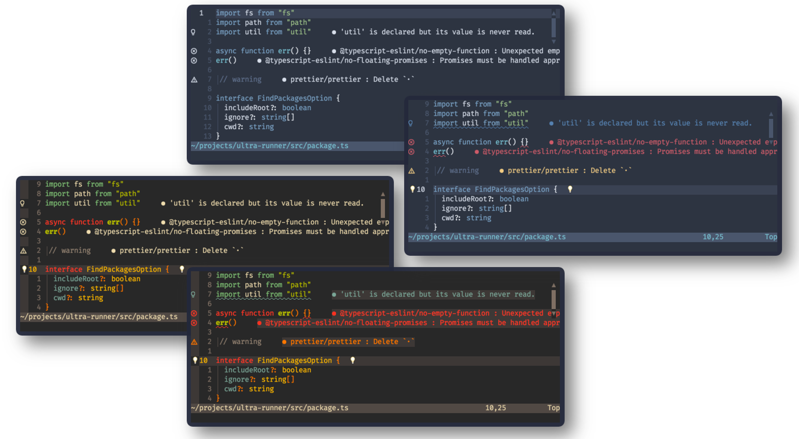

# 🌈 LSP Colors

Automatically creates missing LSP diagnostics highlight groups for color schemes that don't yet support the Neovim 0.5 builtin lsp client.



## ✨ Features

+ supports the latest Neovim 0.5 and 0.6 (HEAD) LSP highlight groups
+ support **any** colorscheme like [Nord](https://github.com/arcticicestudio/nord-vim) and [Gruvbox](https://github.com/morhetz/gruvbox)
+ existing highlight groups from themes will never be overwritten
+ tries to use [coc.nvim](https://github.com/neoclide/coc.nvim) groups if they are defined in the theme
+ if not, we fall back to a default set of colors

## ⚡️ Requirements

+ Neovim >= 0.5.0
  
## 📦 Installation

Install the theme with your preferred package manager:

[vim-plug](https://github.com/junegunn/vim-plug)

```vim
Plug 'folke/lsp-colors.nvim'
```

[packer](https://github.com/wbthomason/packer.nvim)

```lua
use 'folke/lsp-colors.nvim'
```

## 🚀 Usage

Nothing special. Just load a `colorscheme` as usual 🙂

## ⚙️ Configuration

LSP Colors works out of the box, but you can set the default colors that will be used in case a theme doesn't have LSP nor Coc highlight groups.

```lua
-- Lua
require("lsp-colors").setup({
  Error = "#db4b4b",
  Warning = "#e0af68",
  Information = "#0db9d7",
  Hint = "#10B981"
})
```

### Making `undercurls` work properly in **Tmux**

To have undercurls show up and in color, add the following to your **Tmux** config file:

```sh
# Undercurl
set -g default-terminal "${TERM}"
set -as terminal-overrides ',*:Smulx=\E[4::%p1%dm'  # undercurl support
set -as terminal-overrides ',*:Setulc=\E[58::2::%p1%{65536}%/%d::%p1%{256}%/%{255}%&%d::%p1%{255}%&%d%;m'  # underscore colours - needs tmux-3.0
```
